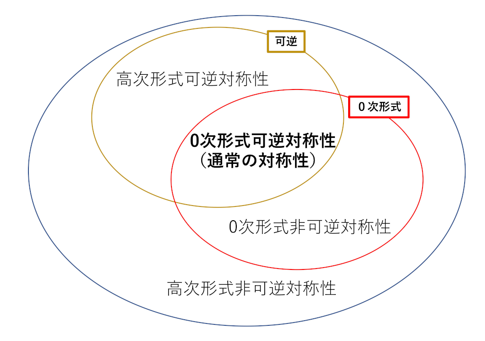
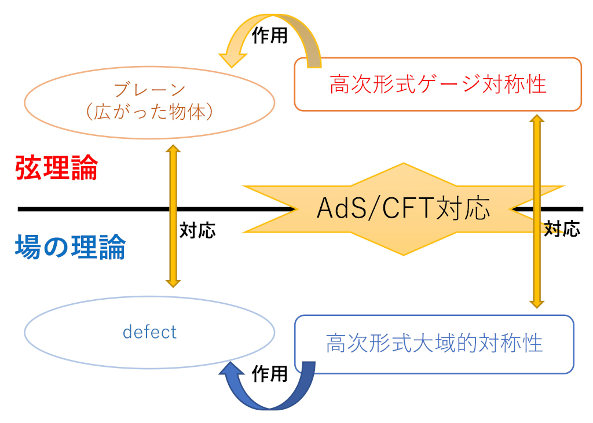

## 興味

弦理論や場の理論の研究を行っています。最近は特に弦理論や場の理論における一般化対称性に興味を持っています。対称性は物理において非常に重要な概念です。場の理論においても対称性は重要で、計算するのが難しい強結合の場の理論の性質が、対称性の議論だけからある程度分かるということがあります。近年、対称性の概念が拡張され、以前は「対称性」と呼んでいなかったものが、対称性と同様に使用でき、場の理論の解析に有用であることが分かってきました。また、これらの「一般化対称性」は弦理論においても重要な役割を果たすと考えています。最近は、場の理論や弦理論における、これら「一般化対称性」の理論の整備と応用に興味を持って取り組んでいます。

## 発表論文リスト

- [発表論文リスト(inspire)](http://inspirehep.net/search?ln=ja&p=FIND+EA+YAMAGUCHI%2C+SATOSHI+OR+EPRINT+HEP-TH%2F9902079&f=&action_search=)
- [発表論文リスト(arXiv)](https://arxiv.org/search/advanced?advanced=&terms-0-operator=AND&terms-0-term=Yamaguchi%2C+Satoshi&terms-0-field=author&classification-physics_archives=all&date-filter_by=all_dates&date-year=&date-from_date=&date-to_date=&date-date_type=submitted_date&abstracts=show&size=50&order=-announced_date_first)

## ノートやスライドのファイル

### 書類など

- [博士論文(pdfファイル)](pdf/d.pdf)
- [修士論文(pdfファイル)](pdf/m.pdf)

### 解説記事など

- [AdS/CFT対応と泡状時空(最近の研究から)](http://ci.nii.ac.jp/naid/110004837341) 以前に物理学会誌に書いた記事です。
 <s>今はオープンになっています。</s>
 見れなくなっているようです。

### オリジナル研究の発表スライドなど
- [一般化対称性について](pdf/generalizedsymmetry.pdf) 駒場で行った集中講義の手書きノートです。
- [Non-invertible symmetry on the lattice](pdf/non-invertible.pdf) 基礎物理学研究所とSeoul National Universityで行った講義の手書きノートです。
- [場の理論におけるアノマリーと指数定理について](pdf/anomaly_index_note.pdf) 神戸大学で行った集中講義の手書きノートです。
- [Non-invertible topological defects in 4-dimensional Z2 pure lattice gauge theory](pdf/dualitydefect.pdf)
- [Supersymmetric quantum field theory with exotic symmetry in 3+1 dimensions and fermionic fracton phases](pdf/fractonsusy.pdf)
- [フェルミオンの経路積分とAtiyah-Patodi-Singer指数](pdf/fermionpathintegral.pdf) Summer School 数理物理2020で講演したときの手書きノートです。
- [フェルミオンの経路積分とAtiyah-Patodi-Singer指数](pdf/anomalynote.pdf) 上のものの予稿です。
- ['t Hooft anomaly matching condition and Chiral symmetry breaking withoutfermion bilinear condensate](pdf/chisb.pdf)
- [Atiyah-Patodi-Singer index from the Domain-Wall Dirac Operator](pdf/aps.pdf)
- [混合大域アノマリーと境界状態](pdf/global-anomaly.pdf)
- [共形場理論の手法による、余次元２のtwist defectの理論のε展開](pdf/defectCFT.pdf)
- [AdS7/CFT6におけるWilson サーフェスとM5-brane (pdfファイル)](pdf/wilson_surface.pdf)

### ちょっとしたノート

- [２次元Ising模型のKramers–Wannier双対性](pdf/ising.pdf) 最近の一般化対称性の文脈でよく現れる２次元Ising模型とKramers–Wannier双対性についてのノートです。
- [ゼータ関数の解析接続](pdf/zeta.pdf) 弦理論やη不変量などで使われる、ゼータ関数の解析接続のちょっとしたまとめです。
- [Dirac演算子の指数定理](pdf/jDirac-index.pdf) 一般の偶数次元でのDirac演算子の指数定理の導出の説明です。
- [様々な次元のスピノール](pdf/spinor.pdf) 様々な次元のスピノールについてのノートです。（2020年３月５日Pin&oline;の表現を追加）

## 科研費

私の研究の一部は科研費のサポートを受けています。
 [KAKEN - 山口 哲(90570672)](https://kaken.nii.ac.jp/search/?qm=90570672)

科研費の応募書類の内容です。
### 研究目的、研究方法など

#### 概要

本研究の目的は、素粒子論などで用いられる連続的な場の理論におけるdefect（欠陥）とその対称性を通じて、場の理論、そして弦理論を理解することである。

対称性は、物理の中で重要な概念である。しかし場の理論において、ラグランジアンやハミルトニアンを見ただけではすぐには分からない「対称性」がありうる。このような場合にdefectを考えることによって、新しい対称性を発見できる可能性がある。ここから、弦理論と場の理論の対応である「AdS/CFT対応」を考えることで、弦理論の対称性に対しても知見がえられ、そこから弦理論の真空に対する制限を得る。さらに、こうして発見した対称性を用いて、従来の方法では難しい強結合の場の理論の相構造の解析も行う。

#### 研究の背景：対称性およびdefect
物理において、「対称性」は非常に重要な概念である。例えばエネルギーなどの保存量は対称性と固く結びついている。また、物質の磁性などの相構造の重要な特徴づけの一つは、対称性の自発的破れである。しかし、我々はこの「対称性」を本当に理解したと言えるだろうか。実は近年の発展により、「対称性」という概念の有用な拡張がなされた。したがって、ここに来て「対称性とはなにか？」をもう一度考え直してみることは、理論の定式化のためにも、また理論の解析のためにも有用であると考えられる。

素粒子物理学などに用いられる場の理論においても対称性の概念は重要である。例えば先にも述べた対称性の自発的破れによる相構造の特徴づけは、場の理論において非常に重要な概念である。従来の対称性の場合には秩序変数が局所演算子の真空期待値になる。

また、量子論的な対称性の非存在の概念である「アノマリー」も非常に重要である。ゲージ対称性におけるアノマリーは理論の不整合性を意味するので理論に対する制約を与える。また、大域的対称性を仮にゲージ化してみたときのアノマリーを考える **'t Hooftアノマリー整合条件** は、場の理論の相構造を考える際の非常に有用なツールである。

弦理論においても対称性は非常に重要である。弦理論においては、対称性はすべてゲージ対称性である。したがってアノマリーの存在は弦理論の不整合性を意味する。このために弦理論には非常に制約が多く、例えば10次元で超対称性を持つ弦理論はアノマリーの制約から5種類しかないことが知られている。また、弦理論の真空にもアノマリーから強い制約がつく。

本研究のもう一つのキーワードである**defect**は、局所演算子の一つの拡張である。局所演算子が時空の点に局在しているのに対して、defectは線や面、あるいはもっと高い次元の部分空間に局在するような演算子である。例えばゲージ理論のWilsonループは１次元に局在したdefectの例である。このためdefectは非局所演算子などとも呼ばれる。場の理論において時空の点に局在する局所演算子が重要であるのは自明だが、実はWilson loopなどのように非局所演算子も重要な役割を果たす。

従来の素粒子論の枠内での場の理論においては、defectはほとんど注目されてこなかった。これは、我々の時空にはそのようなdefectがないので、それを考えることは無意味だという先入観があったためと考えられる。しかし、Wilsonループの例でも分かるように、**我々の時空にないものでも、それを仮に考えてみることにより、理論が深く理解できる**ということがあるのである。このdefectに注目して対称性を深く理解しようというのが本研究の独自性である。

#### 近年の発展：高次形式対称性と非可逆対称性におけるdefect
<figure class="figure">
  
  <figcaption class="figure-caption">対称性の拡張</figcaption>
</figure>

近年の対称性の拡張の一つが**高次形式対称性**[GKSW]である。通常の対称性は局所演算子に作用し、粒子が電荷を持つ。一方で、**高次形式対称性はdefectに作用し、弦やブレーンが電荷を持つ。**実際には高次形式対称性は[GKSW]以前から、うすうすは知られていたのであるが、最近になって分かったことは「場の理論で高次形式対称性が役に立つ」ことである。例えば、申請者の論文[Y]ではフェルミオンの双線型形式は凝縮しないが、カイラル対称性は自発的に破れるというエキゾチックな例を発見した。これは高次形式対称性を含む 't Hooftアノマリー整合条件を用いることによって初めて分かることである。
  
この高次形式対称性においてdefectは次の２つの重要な役割を果たす。

* 高次形式対称性はdefectに作用する。
* 高次形式対称性の一つの定式化は、**トポロジカルdefect**と呼ばれるdefectの一種を用いて行われる。

したがって、defectを通じて高次形式対称性を考えることは、もっとも有望な一つの方向性といえる。

もう一つの対称性の有用な拡張は非可逆対称性である。上の意味での（高次形式）対称性はトポロジカルdefectを用いて定式化されるが、逆に\kyou{理論に現れるトポロジカルdefectが必ずしも（高次形式）対称性を表していない}のである。このような従来の意味での（高次形式）対称性ではないが、トポロジカルdefectは対称性と同じような使い方ができる。このため、これを\kyou{非可逆対称性}と呼び、対称性の一種の拡張と思うことは有用であろう。

これらの対称性の拡張の関係は図（対称性の拡張）にまとめた。
#### 本研究で目指すこと：新しい対称性を用いた場の理論の解析

ゲージ理論は、そのゲージ群や物質の種類により、多種多様な相構造を示す。これは非常に興味深い問題であるが、強結合のゲージ理論の場合には摂動論に基づく解析は使えない。この場合に対称性に基づく解析が有用になる。

本研究の目指すことの一つは、新しい対称性を用いた場の理論の解析である。これには２つの意味がある。一つは、新しい対称性の自発的破れで特徴づけられるような、新たな相が考えられることである。高次形式対称性の場合では、「秩序変数」はdefectの真空期待値になる。例えば閉じ込め・非閉じ込め相はWilsonループの真空期待値が秩序変数になる。Wilsonループの代わりに面に局在したサーフェス演算子の真空期待値を考えれば、それを秩序変数とする新たな相が考えられるのである。**つまり、新たな対称性を発見することは、場の理論の新たな相を発見することなのである。**

もう一つの意味は、新しい対称性を含む't Hooft アノマリー整合条件というツールである。't Hooft アノマリー整合条件とは、't Hooftアノマリーという量がミクロな理論と低エネルギー有効理論で同じであるという性質である。これは、与えられたミクロな理論に対して低エネルギー有効理論に強い制限を与える。

本研究では、様々なゲージ理論に対して新しい対称性に基づく解析を行い、その相構造を明らかにしたいと考えている。  

#### 本研究で目指すこと：弦理論における対称性と真空への制限

<figure class="figure">
  
  <figcaption class="figure-caption">AdS/CFT対応と対称性</figcaption>
</figure>

本研究では、場の理論で得られた知見を弦理論に持ち込み、弦理論の理解に役立てることを考えている。**AdS/CFT対応**（図\ref{fig:adscft}参照）と呼ばれる双対性により、弦理論と場の理論が実は等価であることが予想されている。この枠組では、場の理論のdefectが弦理論での弦やブレーンなどの広がった物体に対応する。場の理論の大域的対称性は弦理論のゲージ対称性に対応する。特に場の理論のdefectに作用する高次形式大域的対称性は、弦理論の弦やブレーンに作用する高次形式ゲージ対称性に対応する。

実は弦理論では古くから連続的な高次形式ゲージ対称性は研究されており、特にブレーンがその電荷を持つことは、重要な事実であった。しかし離散的な（高次形式）ゲージ対称性に関しては、まだまだ知られていないことや見逃されていることが多い。本研究を通して、そのような知られていなかった、あるいは見逃されていた対称性を発見することを目指す。また、このような対称性の「ゲージ場」とブレーンの結合についても明らかにする。これにより、ブレーンの力学をさらに深く理解することを目指す。

さらに、ここで得られた新しい対称性のアノマリーを考えることにより、弦理論の真空に対する新たな制限を得る。弦理論の弱点の一つに、無数の真空があり、この世界を記述する真空がどのように決まったのか分からないというものがある。**新たなアノマリーによる制限から、これまで存在すると考えられてきた真空の一部が、実は存在しないと判明することが期待できる。**

#### 本研究で目指すこと：再び場の理論へ
弦理論で知られていた結果と、本研究で積み上げた知見をAdS/CFT対応などを通じて場の理論に持ち帰ることも目指す。場の理論では、ラグランジアンを見ていただけではなかなか分からない対称性も存在する。またラグランジアンが書けない場の理論というのも知られている。これらに関して、どのような対称性があるかのヒントが弦理論から得られるのである。こうして得られた新たな対称性からは、新たな相が発見でき、また 't Hooftアノマリー整合条件から相構造に対する新たな制限が得られる。

* [GKSW] D. Gaiotto, A. Kapustin, N. Seiberg and B. Willett, "Generalized Global Symmetries," JHEP 1502 (2015) 172.
* [tH] G.~'t Hooft, "Naturalness, chiral symmetry, and spontaneous chiral symmetry breaking," NATO Sci.\ Ser.\ B {\bf 59} (1980) 135.
* [Y] S. Yamaguchi, "'t Hooft anomaly matching condition and chiral symmetry breaking without bilinear condensate," JHEP 1901 (2019) 014.

