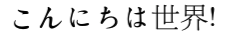
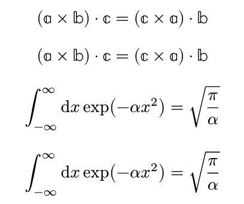
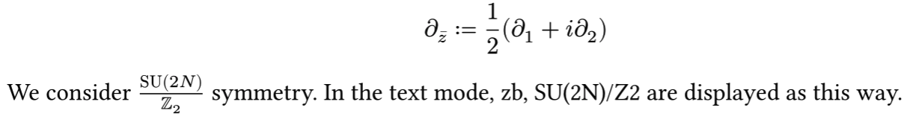
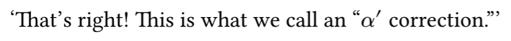
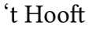
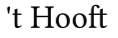
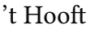

## Typstについて

TypstはLaTeXに似た組版ソフトです。私も少し使ってみて、結構気に入ったので広めたいと思って、このページを作りました。次のような特徴があります。

- 導入が楽。
- 書き方が比較的シンプル。
- タイプセットが速い。
- エラーメッセージが分かりやすい。

2024年2月現在、英語でも日本語でも、自分一人で短めの文章を書くならそれほど不便や違和感を感じないくらいには、完成しています。

一方で欠点としては

- 情報が少ない。
- 使っている人が少ない。
- ツールやライブラリがLaTeXほどは充実していない。
- arXivとか論文雑誌とかで受け付けてもらえない（たぶん）。

なので、私も論文を書くときは、これからもLaTeXを使うと思います。一方で、その他の自分のノートや、授業などで使う資料を書くときにはtypstを使っていくと思います。

Typstに関する情報は、例えば次のところから得られます。

- 公式ページ [Typst: Compose papers faster](https://typst.app/)
- ドキュメント [Typst Documentation](https://typst.app/docs/)
- ドキュメントの日本語訳 [Typstについて – Typstドキュメント日本語版](https://typst-jp.github.io/docs/)
- Typstの様々な情報へのリンク集 [Awesome Typst Links](https://github.com/qjcg/awesome-typst)

## 導入

Typstを使いたい場合、一番お手軽なのはWebアプリ [Typst](https://typst.app/)を使うことです。フォントなどは、代表的なものが入っているので、通常の使い方で困ることは少ないと思います。

ローカルで使いたい場合、例えばvscodeをインストールし"Tinymist Typst"いうパッケージを導入するだけで使えます。typstのコマンドラインツールを別にインストールする必要はありません。

コマンドラインで使いたい場合には、例えばMacではhomebrewを用いてインストールできます。

詳しくは [GitHub - typst/typst](https://github.com/typst/typst)を見てください。

ローカルで使う場合には、システムにインストールされているフォントを使うことができます。使いたいフォントがあれば、システムにインストールすることで使うことができます。あるいは、システムにはインストールせずに環境変数`TYPST_FONT_PATHS`を設定しても使えます。例えば、texliveでインストールしたopen type フォントを使いたい場合、私の環境の例だと

```bash
export TYPST_FONT_PATHS="/usr/local/texlive/2026/texmf-dist/fonts/opentype"
```

と`.zshrc`に書くと使えるようになりました。vscodeでTinymistを使っている場合には設定の`Tinymist: Font Paths`からも設定できると思いますが、試してみたことはありません。

## 使い方

### Hello world

英語ならHello worldは非常に簡単です。おまじないは必要ありません。
ユニコードの文字もそのまま書けば出力できます。

```typst
Hello world!😀
```

出力結果：

英語だけなら、後は [チュートリアル](https://typst.app/docs/tutorial/)と（LaTeXに慣れている方なら）
 [Guide for LaTeX users – Typst Documentation](https://typst.app/docs/guides/guide-for-latex-users/)を読めば、すぐに実用的に使い始めることができると思います。

日本語の場合は、何も考えずにやるとフォントが変になります。

```typst
こんにちは世界！
```

出力結果：

これを解決するための簡単な方法は[Typst Universe](https://typst.app/universe/)に公開されている日本語文書のテンプレートを用いることです。例えば [js](https://typst.app/universe/package/js)、 [jastylest](https://typst.app/universe/package/jastylest)、 [jaconf](https://typst.app/universe/package/jaconf)などが使えます。使い方は、webアプリならstart from templateを押して、テンプレートを選んでください。Search templatesのところに"Japanese"と入れたり、テンプレートの名前("js"など)を入れて出てきたものから選ぶのが楽です。VSCode + Tinymistの場合には、メニュー（macなら⌘+⇧+P）から`typst template`と入力してみてTypst: Show Available Typst Templates …を選んでください。そこから検索するなどして、お目当てのテンプレートから初めてください。 [Typstテンプレートを使用する](https://zenn.dev/kimushun1101/articles/typst-template)に詳しい説明があります。
私自身も簡単な日本語のテンプレートを作ってみましたが、あまり完成度は高くないです。ご参考のために載せておきます。 [Typst の日本語テンプレートの例](https://github.com/satshi/typst-jp-template)

### 数式

個人的に気に入っているのは、数式にユニコードで直接記号を書くことができるところです。次のソースの１行目と２行目、３行目と４行目はそれぞれ同じ結果を出します。

```typst
$ (bb(a) times bb(b)) dot.op bb(c) = (bb(c) times bb(a)) dot.op bb(b) $
$ (𝕒 × 𝕓) · 𝕔 = (𝕔 × 𝕒) · 𝕓 $
$ integral_(-infinity)^(infinity) dif x exp(- alpha x^2) = sqrt(pi/alpha)  $
$ ∫_(-∞)^(∞) dif x exp(- α x^2) = √(π/α) $
```

出力結果：


前々から、テキストエディタで直接表示できるような文字は、そのままで組版ソフトでも使えるべきだと思っていました。LaTeXの場合は今最も使われていると思われるもの（英語ならpdflatex、日本語ならplatexかuplatex）では直接ユニコードを書くことができません。ユニコードが使えるluatexなどを使えばユニコードで数式記号を直接書けるとは思うのですが、互換性がなくなってしまうので、あまり気がすすまないです。例えばjulia言語ではソースにユニコードで数式記号を直接書いて非常に快適なので、typstでユニコードを直接書けるのは非常にありがたいです。

一つの問題は入力方法ですが、これはエディタのサポートが必要です。ローカルの場合にはvscodeのunicode latexのようなパッケージを使うと便利です。Webアプリの場合は、今のところサポートは無いようです。日本語入力ソフトで入力できる記号も多いですし、よく使うものは辞書登録しておくと良いのかもしれません。

### 記号の定義

数式の中で使う記号を自分で定義するところで、少しハマったのでメモ代わりに書いておきます。記号の定義をするときには、基本的に`#let`というコマンドを使います。数式の中で使う記号を定義するときは、定義のところで数式モードにする必要があります。

```typst
#let zb = $macron(z)$
#let Z2 = $bb(Z)_(2)$
#let SU(n)= $"SU"(#n)$

$ ∂_zb:=1/2(∂_1+i∂_2) $
We consider $SU(2N)/Z2$ symmetry.
In the text mode, zb, SU(2N)/Z2 are displayed as this way.
```

出力結果：


LaTeXの`\newcommand`とちがって、変数（？）がそのまま置き換えられるわけではないようです。あと、変数名（？）に数字が使えるのが何気に快適です。

### LaTeXで〇〇はTypstでどうやるの？

基本的に"typst (調べたいLaTeXのコマンド)"でGoogleで検索すると見つかります。
 [Guide for LaTeX users – Typst Documentation](https://typst.app/docs/guides/guide-for-latex-users/#elements)にいろいろ載っているのですが、それ以外で気がついたものを落ち穂ひろい的に書いてみます。

| LaTeX |Typst | コメント|
|----|----|----|
| `% コメント` | `\\ コメント` | |
| `\\` | `\` | 改行 |
| `\tableofcontents` | `#outline()` | |
| `\newpage` | `#pagebreak()` | |
| `\footnote{脚注…}` | `#footnote[脚注…]` | デフォルトはちょっと変 |
| `\hspace{1cm}`| `#h(1cm)` | |
| `\vspace{1cm}`| `#v(1cm)` | |
| `\, \: \; \quad \qquad` | `thin med thick quad wide` | 数式内のスペース。左上から 3/18 em, 4/18 em, 5/18 em, 1 em, 2 em |

### アポストロフィ

Typstでの英語の引用符号などは、空気を読んでうまくやってくれます。

```typst
'That's right! This is what we call an "$α'$ correction."'
```

出力結果：

ここで気になるのは、't Hooft をどう入力するかです。「正しい」文字の説明は [Apostrophe](https://webspace.science.uu.nl/~hooft101/ap.html)にあります。ところが何も考えないで`'t Hooft`と入力するとと出力されてしまいます。なんとかしようとして、エスケープして`\'t Hooft`と入力するとと出力されます。これは間違いとは言えませんが、ちょっと微妙です。私が考えた解決方法は、全角？の’(U+2019)を用いて`’t Hooft`とすることです。そうするとと正しく出力されます。

### 文献

文献の引用も簡単にできます。inspireなどから持ってこれるbibファイルを使うことができ、いろんな引用スタイルも用意されていて、良さそうに見えます。ただ私が探した限り、arXiv番号を出力してくれるスタイルは見つかりませんでした。自分でスタイルファイルを書いてみようとしたのですが、なかなか難しいです。
