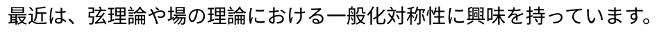

## Typstについて

TypstはLaTeXに似た組版ソフトです。私も少し使ってみて、結構気に入ったので広めたいと思って、このページを作りました。次のような特徴があります。

- 導入が楽。
- 書き方が比較的シンプル。
- タイプセットが速い。
- エラーメッセージが分かりやすい。

2024年2月現在、英語でも日本語でも、自分一人で短めの文章を書くならそれほど不便や違和感を感じないくらいには、完成しています。

一方で欠点としては

- 情報が少ない。
- 使っている人が少ない。
- ツールやライブラリがLaTeXほどは充実していない。
- arXivとか論文雑誌とかで受け付けてもらえない（たぶん）。

なので、私も論文を書くときは、これからもLaTeXを使うと思います。一方で、その他の自分のノートや、授業などで使う資料を書くときにはtypstを使っていくと思います。

Typstに関する情報は、例えば次のところから得られます。

- 公式ページ [Typst: Compose papers faster](https://typst.app/)
- ドキュメント [Typst Documentation](https://typst.app/docs/)
- Typstの様々な情報へのリンク集 [Awesome Typst Links](https://github.com/qjcg/awesome-typst)

## 導入
Typstを使いたい場合、一番お手軽なのはWebアプリ [Typst](https://typst.app/)を使うことです。フォントなどは、代表的なものが入っているので、通常の使い方で困ることは少ないと思います。

ローカルで使いたい場合、例えばvscodeの中で使うなら"Typst LSP"と"Typst preview"いうパッケージを導入すれば、使えます。

コマンドラインで使いたい場合には、例えばMacでhomebrewを入れている場合には

```bash
brew install typst
```

で済みます。詳しくは [GitHub - typst/typst](https://github.com/typst/typst)を見てください。

ローカルで使う場合には、システムにインストールされているフォントを使うことができます。使いたいフォントがあれば、システムにインストールすることで使うことができます。

## 使い方

### Hello world

英語ならHello worldは非常に簡単です。おまじないは必要ありません。
ユニコードの文字もそのまま書けば出力できます。

```typst
Hello world!😀
```

出力結果：

英語だけなら、後は [チュートリアル](https://typst.app/docs/tutorial/)と（LaTeXに慣れている方なら）
 [Guide for LaTeX users – Typst Documentation](https://typst.app/docs/guides/guide-for-latex-users/)を読めば、すぐに実用的に使い始めることができると思います。

日本語の場合は、少し考える必要があります。何も考えずにやると、次のようになります。

```typst
最近は、弦理論や場の理論における一般化対称性に興味を持っています。
```

出力結果：

だいたい問題なさそうな気がしますが、フォントに微妙に違和感があります。

日本語を正しく出すには、少しおまじないが必要です。

```typst
#set text(lang:"ja")
最近は、弦理論や場の理論における一般化対称性に興味を持っています。
```

出力結果：

こうして見てみると、おまじない無しの方は、「論」、「化」、「称」などの文字が通常日本で使われる書体と微妙に異なっていることが分かります。

日本語の通常の文章では、ゴシック体ではなくて、明朝体を使いたいことが多いと思います。フォントを指定するには、次のようにします。

```typst
#set text(lang:"ja", font: "Harano Aji Mincho")
最近は、弦理論や場の理論における一般化対称性に興味を持っています。
```

出力結果：

ここで用いたフォント"Harano Aji Mincho"は、日本語の明朝体のフリーのフォントで、typstのWebアプリにもインストールされています。Webアプリで元からインストールされているフォント一覧は「Ag」と書いてあるボタンを押すと分かります。ローカルでは、コマンドラインから `typst fonts` と入力すると、使えるフォント一覧が分かります。

日本語のちょっと長めの文を書いてみました。文章中の図のファイル[area.svg](img/area.svg)。とりあえず、悪くない出力結果が得られました。ただ、お行儀の良い書き方なのかは、よく分かりません。[出力結果はこちら](pdf/typstexample.pdf)

```typst
#let roman = "Linux Libertine"
#let mincho = "Harano Aji Mincho"
#let kakugothic = "Harano Aji Gothic"
#let math_font = "New Computer Modern Math"

#set text(lang:"ja", font: (roman,mincho), 11pt)

// 行間の調整
//#show par: set block(spacing: 1.3em)
#set par(
  leading: 1em,
  justify: true,
  first-line-indent: 1em,
)

#show heading: it => {
  it
  v(0.8em)
}

// 様々な場所でのフォント
#show heading: set text(font: kakugothic)
#show strong: set text(font: kakugothic)
#show math.equation: set text(font: (math_font,roman,mincho)) 

// 数式番号
#set math.equation(numbering: "(1)")
#show ref: it => {
  let eq = math.equation
  let el = it.element
  if el != none and el.func() == eq {
    // Override equation references.
    numbering(
      el.numbering,
      ..counter(eq).at(el.location())
    )
  } else {
    // Other references as usual.
    it
  }
}

// 図のキャプション
#set figure(gap: 1em)
#show figure.caption: it => [
  #block(width: 90%,
    [図 #counter(figure).display(): #h(0.5em) #it.body])
  #v(1em)
]
#show figure.caption: set text(font: kakugothic, weight: "semibold" ,10pt)
#show figure.caption: set align(left)

// expvalをとってくる
#import "@preview/physica:0.9.2": expval

= レポート問題と解説
#align(right, [担当：山口哲])

== 問題

講義の最後の方に扱った$ℤ_2$ゲージ理論のについて考えよう。この理論は４次元の超立方格子の各リンク$ℓ$に$a_ℓ = 0 , 1$の自由度をおいたもので、その作用は$K$を定数として
$ S (a) = - K ∑_(p ": plaquettes") (- 1)^(∑_(ℓ ∈ p) a_ℓ) $
である。ただし、$∑_(ℓ ∈ p)$はplaquette $p$を構成する４つのリンクについての和を表している。この理論の分配関数は
$ Z = 1 / 2^V ∑_({a}) e^(- S (a) ) quad (V "は頂点の数") $
である。

この理論のWilsonループを考えよう。リンクを繋いでいってできるループ$C$に対してWilsonループ$W (C)$が定義され、その期待値は 
$
expval(W(C)) = 1/Z 1/2^V ∑_{a} e^(-S(a)) (-1)^(∑_(ℓ ∈ C)a_ℓ)
$
と表される。

$K ≪ 1$の場合、このWilsonループの期待値が「面積則」になることを次のようにして示せ。 簡単のため、ループ$C$を12平面上で辺の長さが $L_1 , L_2$ の長方形に取る。長さの単位は格子間隔が $1$ となるようにとることにする。$expval(W(C))$を$K$でべき展開し、$0$ にならない最低次を見ることにより、$L_1 , L_2$依存性が
$ expval(W(C)) ∼ exp(- T L_1 L_2) $
となることを示せ。また定数 $T$ を求めよ。

ヒント： 以下に挙げる書籍や他の文献で、ゲージ群がSU$(N)$ (SU$(3)$)の場合の解説がある。これらの文献では群の積分の公式を導いて用いている。今回考えたモデルのように、ゲージ群が $ℤ_2$ の場合には、代わりに必要な公式は $b = 0, 1$ として $∑_(a = 0 , 1) (- 1)^(a b)$ がどうなるかというものである。

- M. Creutz, "Quarks, Gluons and Lattices," Oxford University Press, 1983, doi:10.1017/9781009290395

- H. J. Rothe, "Lattice Gauge Theories : An Introduction (Fourth Edition)," World Scientific Publishing Company, 2012, doi:10.1142/8229

- 青木慎也, "格子上の場の理論," 丸善出版.

#pagebreak()
== 解説

$ S (a) = - K ∑_(p ": plaquettes") (- 1)^(∑_(ℓ in p) a_ℓ) $
として、分配関数は 
$ Z = 1 / 2^V ∑_({ a }) e^(- S lr((a))) , $<pf>
Wilsonループの期待値は
$ expval(W (C)) = 1/Z 1/2^V ∑_({a}) e^(-S(a)) (-1)^(∑_(ℓ in C)a_(ℓ)) $<wl>
と表される。これらを$K ≪ 1$の場合に$K$でべき展開し、その最低次を考える。

まず、分配関数は
$ Z = 1 / 2^V ∑_({ a }) (1 + O (K)) = 2^(E - V) + O (K) $
となる。ここで$E$はリンクの数である。

#figure(
  [#box(width: 8cm, image("area.svg"))],
  caption: [Wilsonループの期待値への$0$でない$K$の最低次の寄与。赤線、黒線はともにリンク変数の$lr((- 1))^(a_ℓ)$寄与があることを表す。赤線はWilsonループの挿入から、黒線は作用からの寄与を表す。すべてのリンクに関して線は偶数個（0または2）になっているので$(- 1)^(a_ℓ)$の寄与はキャンセルしている。作用からのplaquettesは$A := L_1 L_2$個ある。],
)
<area>

次にWilsonループの期待値 @wl の和について考える。$e^(- S (a))$を展開すると各項は$(- 1)^(a_ℓ)$の単項式になる。このとき、あるリンク$ℓ$に対して$(- 1)^(a_ℓ)$を非自明に因子に持つ項があったとすると、$∑_(a_ℓ = 0 , 1) (- 1)^(a_ℓ) = 0$となるために、その項からの寄与は$0$になってしまう。したがって、残る項はすべてのリンクに対して$(- 1)^(a_ℓ)$が偶数回入っているものである。その中で$K$の最低次の項は、@area のように作用から来るplaquettesがWilsonループを端に持つ最小面積の面を埋め尽くすものである。これは$A := L_1 L_2$個のplaquettesが入っているので、$K^A$に比例する項である。

ここまでで@wl の$0$でない最低次の項は$K^A$であることが分かったので、その項を計算していく。
$ expval(W (C))
&=1/Z 1/2^V ∑_({a}) (K^A)/(A!) ( ∑_p (-1)^(∑_(m in p) a_(m)))^A (-1)^(∑(ℓ in C) a_ℓ) + O(K^(A+1)) \
&=1/Z 1/2^V ∑_({a})K^A + O(K^(A+1)) \
&=K^A + O (K^(A+1))
tilde exp(-(- log K) A). 
 $<result>
ただし、一行目から二行目へは$(dots.h.c)^A$の展開で、面をきっちり埋め尽くすような項が$A !$項あり、それぞれがWilsonループからの寄与を合わせて$1$であることを用いた。また二行目から三行目へは分配関数の結果 @pf を用いた。

@result は面積則を示していて、$T = - log K$である。
```

### 数式

個人的に気に入っているのは、数式にユニコードで直接記号を書くことができるところです。次のソースの１行目と２行目、３行目と４行目はそれぞれ同じ結果を出します。

```typst
$ (bb(a) times bb(b)) dot.op bb(c) = (bb(c) times bb(a)) dot.op bb(b) $
$ (𝕒 × 𝕓) · 𝕔 = (𝕔 × 𝕒) · 𝕓 $
$ integral_(-infinity)^(infinity) dif x exp(- alpha x^2) = sqrt(pi/alpha)  $
$ ∫_(-∞)^(∞) dif x exp(- α x^2) = √(π/α) $
```

出力結果：


前々から、テキストエディタで直接表示できるような文字は、そのままで組版ソフトでも使えるべきだと思っていました。LaTeXの場合は今最も使われていると思われるもの（英語ならpdflatex、日本語ならplatexかuplatex）では直接ユニコードを書くことができません。ユニコードが使えるluatexなどを使えばユニコードで数式記号を直接書けるとは思うのですが、互換性がなくなってしまうので、あまり気がすすまないです。例えばjulia言語ではソースにユニコードで数式記号を直接書いて非常に快適なので、typstでユニコードを直接書けるのは非常にありがたいです。

一つの問題は入力方法ですが、これはエディタのサポートが必要です。ローカルの場合にはvscodeのunicode latexのようなパッケージを使うと便利です。Webアプリの場合は、今のところサポートは無いようです。日本語入力ソフトで入力できる記号も多いですし、よく使うものは辞書登録しておくと良いのかもしれません。

### 記号の定義

数式の中で使う記号を自分で定義するところで、少しハマったのでメモ代わりに書いておきます。記号の定義をするときには、基本的に`#let`というコマンドを使います。数式の中で使う記号を定義するときは、定義のところで数式モードにする必要があります。

```typst
#let zb = $macron(z)$
#let Z2 = $bb(Z)_(2)$
#let SU(n)= $"SU"(#n)$

$ ∂_zb:=1/2(∂_1+i∂_2) $
We consider $SU(2N)/Z2$ symmetry.
In the text mode, zb, SU(2N)/Z2 are displayed as this way.
```

出力結果：


LaTeXの`\newcommand`とちがって、変数（？）がそのまま置き換えられるわけではないようです。あと、変数名（？）に数字が使えるのが何気に快適です。

### アポストロフィ

Typstでの英語の引用符号などは、空気を読んでうまくやってくれます。
```
'That's right! This is what we call an "$α'$ correction."'
```
出力結果：

ここで気になるのは、't Hooft をどう入力するかです。「正しい」文字の説明は [Apostrophe](https://webspace.science.uu.nl/~hooft101/ap.html)にかります。ところが何も考えないで`'t Hooft`と入力するとと出力されてしまいます。なんとかしようとして、エスケープして`\'t Hooft`と入力するとと出力されます。これは間違いとは言えませんが、ちょっと微妙です。私が考えた解決方法は、全角？の’(U+2019)を用いて`’t Hooft`とすることです。そうするとと正しく出力されます。
